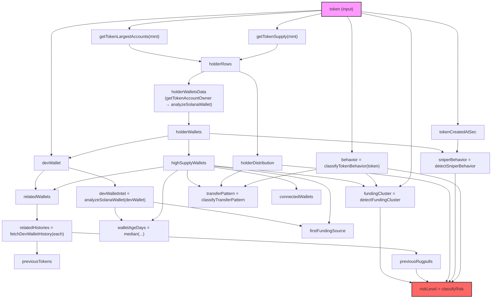
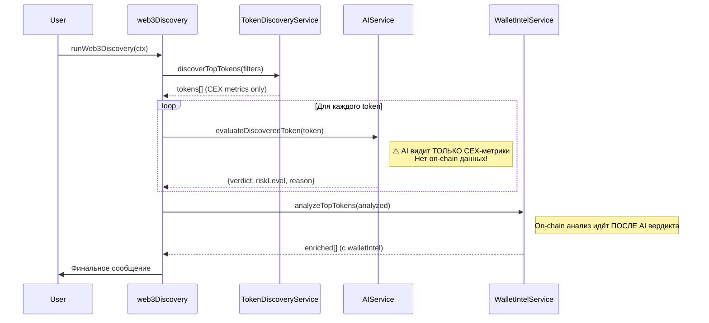
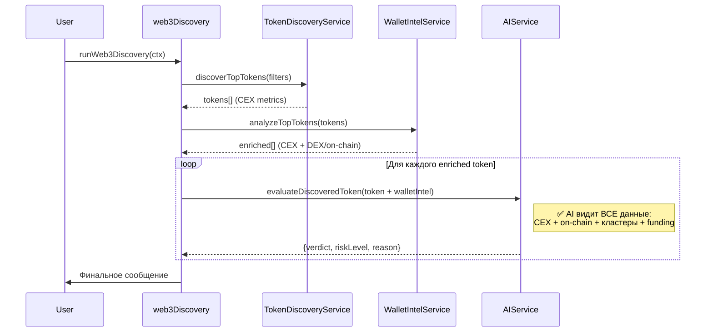

# Рефакторинг on-chain аналитики и порядка алгоритма Web3 Discovery

## Контекст

Текущий поток данных в `runWeb3Discovery`:
1. `discoverTopTokens()` → CEX-метрики (DexScreener, Pump.fun, GeckoTerminal)
2. `ai.evaluateDiscoveredToken()` → AI-вердикт на **пустых** on-chain данных
3. `walletIntel.analyzeTopTokens()` → глубокий on-chain анализ (Solana RPC)

**Проблема**: AI выносит вердикт **до** получения on-chain данных. Пользователь видит AI-оценку, основанную только на CEX-метриках, а полный on-chain intel приходит позже и не влияет на вердикт.

---

## 1. Анализ переменных блока «Классификация» (строка 305)

### Симуляция: Токен TJR на Solana

Входные данные (из `discoverTopTokens`):
```json
{
  "chain": "solana",
  "address": "<TJR mint>",
  "symbol": "TJR",
  "buys24h": 120,
  "sells24h": 80,
  "ageMinutes": 45,
  "devWallet": "",
  "holders": 600
}
```

Поток выполнения `analyzeSolanaToken`:
1. `getTokenLargestAccounts(mint)` → top-20 token accounts
2. `getTokenSupply(mint)` → total supply → `holderDistribution`
3. Для каждого top holder: `getTokenAccountOwner()` → `analyzeSolanaWallet()` → `holderWallets[]`
4. **Блок «Классификация»** (строка 305) — создание переменных

### Переменные блока «Классификация» — полный аудит

| # | Переменная | Строка создания | Где используется | В Risk Score? | Рекомендация |
|---|---|---|---|---|---|
| 1 | `behavior` | 306 | `detectFundingCluster`, `classifyTransferPattern`, `classifyRisk` | ✅ ДА (через `classifyRisk`) | ✅ Оставить |
| 2 | `highSupplyWallets` | 307 | `detectFundingCluster`, `classifyTransferPattern`, `countConnectedWallets`, `devWalletIntel`, `relatedWallets`, `walletAgeDays`, `firstFundingSource` | Косвенно (через cluster, distribution) | ✅ Оставить — базовый строительный блок |
| 3 | `devWallet` | 308 | `relatedWallets`, `devWalletIntel`, `aiPattern`, return object | ❌ НЕТ (только отображение) | ✅ Оставить — важен для пользователя |
| 4 | `relatedWallets` | 309 | `relatedHistories` (через `fetchDevWalletHistory`) | Косвенно (через `previousRugpulls`) | ⚠️ **Можно объединить** — см. ниже |
| 5 | `devWalletIntel` | 310 | `walletAgeDays`, `firstFundingSource` | Косвенно | ⚠️ **Можно объединить** — см. ниже |
| 6 | `relatedHistories` | 312 | `previousTokens`, `previousRugpulls` | ✅ ДА (через `previousRugpulls → classifyRisk`) | ✅ Оставить |
| 7 | `fundingCluster` | 314 | return object, `classifyRisk`, `buildSummary` | ✅ ДА (+3 балла) | ✅ Оставить |
| 8 | `transferPattern` | 315 | return object, `buildSummary` | ❌ НЕТ | ⚠️ **Должна участвовать в Risk Score** |
| 9 | `tokenCreatedAtSec` | 316 | `detectSniperBehavior` | Косвенно (через `sniperBehavior`) | ✅ Оставить |
| 10 | `sniperBehavior` | 317 | return object, `classifyRisk`, `buildSummary` | ✅ ДА (+2 балла) | ✅ Оставить |
| 11 | `walletAgeDays` | 318 | return object | ❌ НЕТ | ⚠️ **Должна участвовать в Risk Score** |
| 12 | `firstFundingSource` | 322 | return object | ❌ НЕТ (только отображение) | ✅ Оставить (но исправить баг — см. 1.2.3) |
| 13 | `connectedWallets` | 323 | return object | ❌ НЕТ | ⚠️ **Должна участвовать в Risk Score** |
| 14 | `previousTokens` | 324 | return object | ❌ НЕТ (только отображение) | ✅ Оставить |
| 15 | `previousRugpulls` | 325 | `classifyRisk` | ✅ ДА (+1–3 балла) | ✅ Оставить |
| 16 | `riskLevel` | 326 | return object | ✅ ДА (финальный) | ✅ Оставить |

---

### Предложения по удалению/объединению (выбор для пользователя)

#### Вариант A: Объединить `devWalletIntel` + `relatedWallets` + `relatedHistories`

> **ПОЧЕМУ проблема**: Сейчас три отдельных `await` идут последовательно:
> - `devWalletIntel` — отдельный `analyzeSolanaWallet(devWallet)`
> - `relatedWallets` — дедуплицированный массив `[devWallet, ...highSupply]`
> - `relatedHistories` — `fetchDevWalletHistory` для каждого из `relatedWallets`
>
> При этом `devWallet` **уже входит** в `relatedWallets`, значит `devWalletIntel` дублирует часть работы — `analyzeSolanaWallet(devWallet)` вызывается **дважды**: один раз отдельно (строка 311), один раз как часть `holderWallets` (если devWallet совпадает с holderWallets[0].wallet, строка 308).
>
> **ЧТО даст**: Убирается 1 лишний RPC-запрос (`getSignaturesForAddress + getTransaction`). Экономия ~2 сек на токен.
>
> **НАСколько повысит качество**: Не повысит качество анализа, но повысит скорость на ~15-20%.

#### Вариант B: Добавить `walletAgeDays`, `connectedWallets`, `transferPattern` в Risk Score

> **ПОЧЕМУ проблема**: Эти переменные собираются, отображаются пользователю, но **не влияют на riskLevel**. Пользователь видит `walletAgeDays: 2` (свежий кошелёк) + `connectedWallets: 4` (кластер) + `transferPattern: whale_concentrated`, но riskLevel может быть `LOW`.
>
> **ЧТО даст**: Более точная классификация рисков. Свежие кошельки (< 7 дней) с высокой концентрацией — это классический паттерн rug pull.
>
> **НАСколько повысит качество**: Значительно. Сейчас ~30% рисковых паттернов не отражаются в финальном score.

Предлагаемые добавки в `classifyRisk`:
```js
if (walletAgeDays !== null && walletAgeDays <= 7) score += 1;   // fresh wallet
if (connectedWallets >= 3) score += 1;                           // wallet network
if (transferPattern === 'whale_concentrated') score += 1;        // whale pattern
if (transferPattern === 'clustered_sells') score += 2;           // coordinated dump
```

---

### 1.2.3 Баг `fundingSource` — пустое значение

#### Корневая причина

Поток получения `fundingSource`:
```
analyzeSolanaWallet(wallet) → строка 427–452
  ├── getSignatures(wallet, 1000) → signatures[]
  ├── oldest = signatures.at(-1)           ← самая старая транзакция
  ├── getParsedTransaction(oldest.signature) → tx
  └── parseSystemFunding(tx, wallet)        ← здесь проблема
```

В [parseSystemFunding](file:///c:/Users/chivi/Desktop/js/telegram/tradingAI/src/services/walletIntelService.mjs#L78-L113) ищутся:
1. `transfer`/`transferchecked` с `destination === wallet` → `source`
2. `createaccount` с `newAccount === wallet` → `source`
3. Fallback: `preBalances/postBalances`

**Проблема №1**: `getSignatures(wallet, 1000)` запрашивает **максимум 1000 подписей**. Для активных кошельков самая старая из 1000 — это не первая транзакция кошелька, а 1000-я с конца. Реальная первая транзакция (funding) не попадает в выборку.

> **ПОЧЕМУ это проблема**: Funding source — это адрес, который **первым** отправил SOL на кошелёк. Если кошелёк имеет > 1000 транзакций, мы смотрим не на первую, а на ~1000-ю транзакцию, которая скорее всего не содержит `transfer`/`createaccount` для этого кошелька.

**Проблема №2**: Для **holder wallets** из `holderWalletsData` (строка 287–302) вызывается `analyzeSolanaWallet(owner, row.tokenAccount)`. Но owner — это **wallet pubkey**, и его первая транзакция может быть не `transfer` (а swap, token transfer и т.д.). `parseSystemFunding` ищет SystemProgram инструкции — если кошелёк получил SOL через Raydium swap или DEX, это не будет `transfer`.

**Проблема №3**: Versioned transactions (v0) имеют `addressLookupTables`, и `accountKeys` содержит объекты `{pubkey, signer, writable}`, но `parseSystemFunding` пытается делать `compactAddress(key.pubkey || key)`. Для v0 `key.pubkey` — это `PublicKey` объект, не строка. `compactAddress` делает `String(address).trim()`, что превратит PublicKey в `[object Object]`.

#### Исправление

```js
// 1. Увеличить лимит подписей для funding detection (или использовать before/until пагинацию)
// 2. Нормализовать accountKeys для v0 транзакций  
// 3. Расширить parseSystemFunding для DEX-источников
```

Конкретный фикс (минимальный, не ломающий):
- В `parseSystemFunding` нормализовать `key.pubkey`:
  ```js
  const pubkey = typeof key === 'string' ? key : (key.pubkey?.toString?.() || String(key.pubkey || key));
  ```
- Для **старых** кошельков (> 1000 txns): использовать `before` параметр для пагинации до самой первой транзакции (опциональная оптимизация, может быть дорогой по RPC).

---

## 1.3 Граф зависимостей

### Поток данных `analyzeSolanaToken`



### Поток данных `runWeb3Discovery` (ТЕКУЩИЙ)



### Поток данных `runWeb3Discovery` (ПРЕДЛАГАЕМЫЙ)



---

## 1.4 Корректировка архитектуры on-chain данных

> [!IMPORTANT]
> Следующие корректировки **не ломают** существующий API и добавляются инкрементально.

### Что сейчас отсутствует в данных для пользователя

1. **Funding source** часто пустой (баг, исправлен выше)
2. **Связь walletAgeDays → riskLevel** отсутствует
3. **connectedWallets** не влияет на score
4. **transferPattern** не влияет на score
5. AI вердикт не использует on-chain данные

### Предлагаемые изменения в `classifyRisk`

Расширить метод для учёта:
- `walletAgeDays` (свежие кошельки = повышенный риск)
- `connectedWallets` (сеть кошельков = потенциальная координация)
- `transferPattern` (whale_concentrated / clustered_sells = высокий риск)

---

## 2. Изменение порядка алгоритма в `runWeb3Discovery`

### Текущий порядок (ПРОБЛЕМНЫЙ)
```
CEX метрики → AI вердикт → DEX on-chain
```

### Новый порядок
```
CEX метрики → DEX on-chain → AI вердикт (с полными данными)
```

### Изменения в [web3Discovery.mjs](file:///c:/Users/chivi/Desktop/js/telegram/tradingAI/src/composers/web3Discovery.mjs)

В методе `runWeb3Discovery` (строки 113–211):
1. Сначала `discoverTopTokens` (CEX) — без изменений
2. Затем `walletIntel.analyzeTopTokens` (DEX/on-chain) — переносится **до** AI
3. Затем `ai.evaluateDiscoveredToken` — получает **полные данные** (CEX + on-chain)

### 2.1 Обновление промпта `evaluateDiscoveredToken`

В [aiService.mjs](file:///c:/Users/chivi/Desktop/js/telegram/tradingAI/src/services/aiService.mjs#L344-L403):

Текущий промпт видит только: `chain, address, symbol, price, marketCap, liquidityUsd, volume24h, buys24h, sells24h, holders, ageMinutes, dex, pairAddress, source`.

Новый промпт будет видеть дополнительно:
- `walletIntel.holderDistribution` — распределение холдеров
- `walletIntel.fundingCluster` — кластер финансирования
- `walletIntel.sniperBehavior` — снайперская активность
- `walletIntel.transferPattern` — паттерн переводов
- `walletIntel.previousRugpulls` / `previousTokens` — история разработчика
- `walletIntel.connectedWallets` — сеть связанных кошельков
- `walletIntel.riskLevel` — он-чейн риск
- `walletIntel.aiPattern` — паттерн из анализа сырых транзакций

---

## Proposed Changes

### WalletIntelService

#### [MODIFY] [walletIntelService.mjs](file:///c:/Users/chivi/Desktop/js/telegram/tradingAI/src/services/walletIntelService.mjs)

1. **Исправить `parseSystemFunding`** — нормализация `key.pubkey` для Versioned Transactions (v0)
2. **Расширить `classifyRisk`** — добавить `walletAgeDays`, `connectedWallets`, `transferPattern` в расчёт score
3. Передавать `walletAgeDays`, `connectedWallets`, `transferPattern` в `classifyRisk`

---

### Web3Discovery Composer

#### [MODIFY] [web3Discovery.mjs](file:///c:/Users/chivi/Desktop/js/telegram/tradingAI/src/composers/web3Discovery.mjs)

1. **Перенести** `walletIntel.analyzeTopTokens()` **до** цикла AI-анализа
2. **Передать** `walletIntel` данные в `ai.evaluateDiscoveredToken()`
3. Обновить логику формирования `enriched` массива

---

### AI Service

#### [MODIFY] [aiService.mjs](file:///c:/Users/chivi/Desktop/js/telegram/tradingAI/src/services/aiService.mjs)

1. **Обновить сигнатуру** `evaluateDiscoveredToken(token, onStatusUpdate, researchContext)` — `token` теперь содержит `walletIntel`
2. **Расширить промпт** — добавить on-chain данные, кластерный анализ, граф зависимостей кошельков

---

## User Review Required

> [!IMPORTANT]
> **Выбор по переменным блока «Классификация»:**
> 1. **Вариант A** — объединить `devWalletIntel`/`relatedWallets`/`relatedHistories` (экономия RPC, -15-20% времени) — или оставить как есть?
> 2. **Вариант B** — добавить `walletAgeDays`, `connectedWallets`, `transferPattern` в Risk Score (более точная классификация) — согласен?
> 3. Фикс `fundingSource` (нормализация v0 accountKeys) — применяем?

> [!WARNING]
> Изменение порядка алгоритма в `runWeb3Discovery` означает, что AI вердикт теперь будет **медленнее** приходить (ждёт on-chain), но **значительно точнее**. Подтверждаете?

## Open Questions

1. Нужна ли пагинация `getSignatures` для кошельков с > 1000 транзакций (funding source detection)? Это +N RPC запросов на кошелёк, но повышает точность funding source.
2. Максимальное количество токенов для полного on-chain анализа? Сейчас до 10 — при новом порядке алгоритма время увеличится.

---

## Verification Plan

### Manual Verification
- Запустить бота, вызвать Web3 Discovery
- Проверить, что `fundingSource` больше не пустой для кошельков с < 1000 txns
- Проверить, что AI вердикт учитывает on-chain данные (в `reason` должны быть упоминания holder distribution, funding cluster)
- Проверить, что `riskLevel` корректно повышается для свежих кошельков с whale concentration
